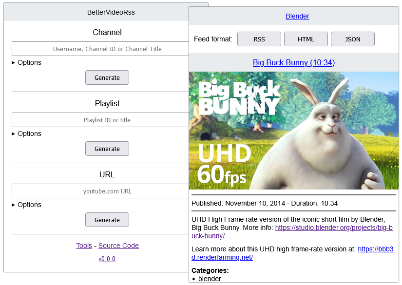

# BetterVideoRss

[](https://github.com/VerifiedJoseph/better-video-rss/releases/latest)
[](LICENSE.md)

BetterVideoRss is a PHP script for generating YouTube channel and playlist RSS feeds using YouTube's [Data API](https://developers.google.com/youtube/v3/) and RSS feeds.



## Installation

### docker-compose

<details>
<summary>Show/hide details</summary>

```yaml
version: '3'

services:
  app:
    image: ghcr.io/verifiedjoseph/better-video-rss:1.6.0
    container_name: BetterVideoRss
    environment:
      BVRSS_YOUTUBE_API_KEY: ''
      BVRSS_SELF_URL_PATH: 'https://example.com/'
      BVRSS_TIMEZONE: 'Europe/London'
    ports:
      - '127.0.0.1:8080:8080'
    volumes:
      - cache:/app/cache
    cap_drop:
      - ALL
    security_opt:
      - no-new-privileges:true

volumes:
  cache:
```

</details>

### Manually

<details>
<summary>Show/hide install details</summary>

1) Download the [latest release](https://github.com/VerifiedJoseph/better-video-rss/releases/latest) to your web server and extract the zip archive.

2) Configure the application using `config.php` copied from [`config.example.php`](config.example.php).
	
	```
	cp config.php-dist config.php
	```

**Notes**

The cache and vendor folders do not need to be reachable in the browser and access should blocked.

</details>


## Configuration

Environment variables are used to adjust the configuration. Alternatively, you can use `config.php` (copied from [`config.example.php`](config.example.php)).

### Required variables

| Name                    | Type     | Description                                                                                                 |
| ----------------------- | -------- | ----------------------------------------------------------------------------------------------------------- |
| `BVRSS_SELF_URL_PATH`   | `string` | Fully qualified URL used to access BetterVideoRss.                                                          |
| `BVRSS_YOUTUBE_API_KEY` | `string` | YouTube API Key ([developers.google.com](https://developers.google.com/youtube/registering_an_application)) |

### Optional variables

| Name                        | Type      | Default value | Description                                                                                        |
| --------------------------- | --------- | ------------- | -------------------------------------------------------------------------------------------------- |
| `BVRSS_TIMEZONE`            | `string`  | `UTC`         | Timezone ([php docs](https://www.php.net/manual/en/timezones.php))                                 |
| `BVRSS_DATE_FORMAT`         | `string`  | `F j, Y`      | Date format ([php docs](https://www.php.net/manual/en/datetime.format.php))                        |
| `BVRSS_TIME_FORMAT`         | `string`  | `H:i`         | Time format ([php docs](https://www.php.net/manual/en/datetime.format.php))                        |
| `BVRSS_CACHE_DIR`           | `string`  | `cache`       | Cache directory path.                                                                              |
| `BVRSS_DISABLE_CACHE`       | `boolean` | `false`       | Disables caching.                                                                                  |
| `BVRSS_ENABLE_CACHE_VIEWER` | `boolean` | `false`       | Enables cache viewer.                                                                              |
| `BVRSS_ENABLE_IMAGE_PROXY`  | `boolean` | `false`       | Enables video thumbnail image proxy.                                                               |
| `BVRSS_DISABLE_CSP`         | `boolean` | `false`       | Disables [content security policy](https://developer.mozilla.org/en-US/docs/Web/HTTP/CSP).         |
| `BVRSS_RAW_API_ERRORS`      | `boolean` | `false`       | Enables displaying of raw API errors.                                                              |

## Documentation

- [Caching](docs/caching.md)

## Requirements

- PHP >= 8.1
- Composer
- PHP Extensions:
  - [`curl`](https://secure.php.net/manual/en/book.curl.php)
  - [`mbstring`](https://secure.php.net/manual/en/book.mbstring.php)
  - [`simplexml`](https://secure.php.net/manual/en/book.simplexml.php)

## Changelog

All notable changes to this project are documented in the [CHANGELOG](CHANGELOG.md).

## License

MIT License. Please see [LICENSE](LICENSE) for more information.
